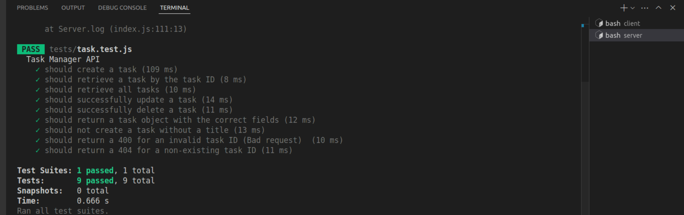

# DTS Developer Technical Test

## 🎯Objective
To build a simple API and a frontend for managing tasks using best coding practices.

## 🚀Getting started
## 1.Fork & Clone the repository
- Click the **fork** button on the GitHub repo
- Clone the forked repo:
- `git clone __repo-link____`
- `cd repo__name`

## 2. Set up the backend server
- `cd server`
- `npm install`
- `nodemon index`

## 3. Set up the frontend client
- `cd client`
- `npm install`
- `npm run dev`

## 4.View the app!
- Frontend should be running at *http://localhost:5173*
- Backend API at *http://localhost:5000*

## 🛠️Tech Stack
- **Backend:** Node.js, Express
- **Frontend:** React, Bootstrap
- **Database:** PostgreSQL
- **Testing:** Jest
- **Other tools:** CORS, dotenv

## ✨Features
### Backend
- Create a task with the fields; Title, optional description, status, due date/time
- Retrive all tasks
- Retrive a single task by ID
- Update a task's status or description
- Delete a task

### Frontend
- Create, view, update and delete tasks
- Clean and user-friendly UI with bootstrap


## 📚API Endpoints
### Create a task
- URL: `/tasks`
- Method: `POST`
- Body: 
```json
{
    "title": "Task title",
    "description": "Optional description",
    "status": "Incomplete",
    "due_date": "2025-04-23T10:00:00"
}
```

### Retrieve a task
- URL: `/tasks/:id`
- Method: `GET`

### Retrieve all tasks
- URL: `/tasks`
- Method: `GET`

### Update a task
- URL: `/tasks/:id`
- Method: `PUT`
- Body: 
```json
{
    "description": "New description",
    "status": "Complete"
}
```

### Delete a task
- URL: `/tasks/:id`
- Method: `DELETE`


## 🧪Testing
To run backend tests:
- `cd server`
- `npm test`


